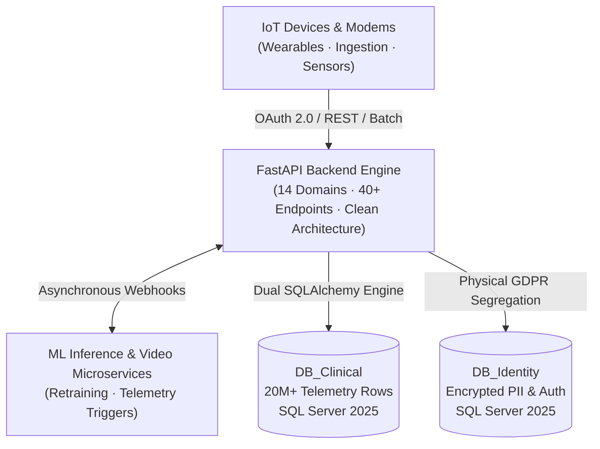

# Distributed IoT Telemetry & Analytics Platform (Backend)

> 🔒 **Private Repository** — Enterprise & Research Project (European Consortium).  
> Demonstrator presented internationally in Berlin (June 2026).

High-throughput distributed backend engineered with **FastAPI** and **Microsoft SQL Server 2025**, processing longitudinal time-series telemetry from medical IoT devices across **100k+ users** and **20M+ time-series records**.

---

## 🏛️ System Architecture

## ⚡ Technical Highlights

### 1. High-Throughput Ingestion & Data Cleansing
- Ingested and normalized **15M+ daily telemetric sessions** and **800k+ field survey events**.
- Optimized batch pipelines using in-memory set indexing (`O(1)` foreign key checks) and chunked transactions (500–1000 records/commit).
- Resilient parsing: regex French decimal normalization, automated sentinel date sanitation, and missing-data tracking.

### 2. Multi-Database Architecture & GDPR Isolation
- Partitioned **Microsoft SQL Server 2025** into 4 physically isolated databases (`Clinical`, `Identity`, `Staging`, `Sandbox`).
- Enforced strict physical separation between de-identified telemetry and personal data (PII).
- Dual connection pooling via SQLAlchemy/pyodbc; personal details joined strictly in-memory at runtime.
- Built automated regulatory audit logging (GDPR Art. 30 compliance) tracking clinician access.

### 3. IoT Synchronization & Wearable Pipelines
- Built an automated sync pipeline for **Withings Health API v2** (ScanWatch & BPM Core) using **OAuth 2.0** with token auto-refresh.
- Implemented exponential backoff and rate limiting (120 calls/min) buffering raw payloads into a 9-table staging schema before normalizing into clinical rollups.
- Integrated external time-series streams: SomnoArt EEG polysomnography, Masimo continuous SpO2/pulse oximetry, and Hexoskin plethysmography.

### 4. Feature Engineering & Cross-Service Webhooks
- Engineered an automated 7-day rolling window aggregation pipeline generating multi-variate feature vectors via idempotent SQL Server `MERGE` upserts.
- Integrated asynchronous retraining webhooks and low-latency inference routing with an external PyTorch ML microservice.
- Built a clinical trigger engine evaluating telemetry anomalies to assign targeted educational coaching assets with WebVTT subtitle streaming.

### 5. Production DevOps & CI/CD
- Deployed on Windows Server 2025 using **NSSM** service manager (`CpapBackend`).
- Continuous deployment via Windows Task Scheduler auto-polling GitHub `master` (60-second cycle).
- Built an in-memory, CI-compatible `pytest` test suite with 100% pass rate.

---

## 🛠️ Tech Stack

| Layer | Technologies |
| :--- | :--- |
| **Language & Frameworks** | Python 3.14 · FastAPI · Pydantic v2 · SQLAlchemy 2.0 · Uvicorn |
| **Databases & Drivers** | Microsoft SQL Server 2025 · pyodbc (ODBC Driver 18) · PostgreSQL |
| **Security & Auth** | Stateless JWT (HMAC-SHA256) · Bcrypt (passlib) · RBAC · IDOR Protection |
| **Protocols & IoT** | RESTful JSON · Withings Health API (OAuth 2.0) · OpenAPI / Swagger UI · WebVTT |
| **DevOps & QA** | Windows NSSM · Windows Task Scheduler (CI/CD) · Git · pytest |
